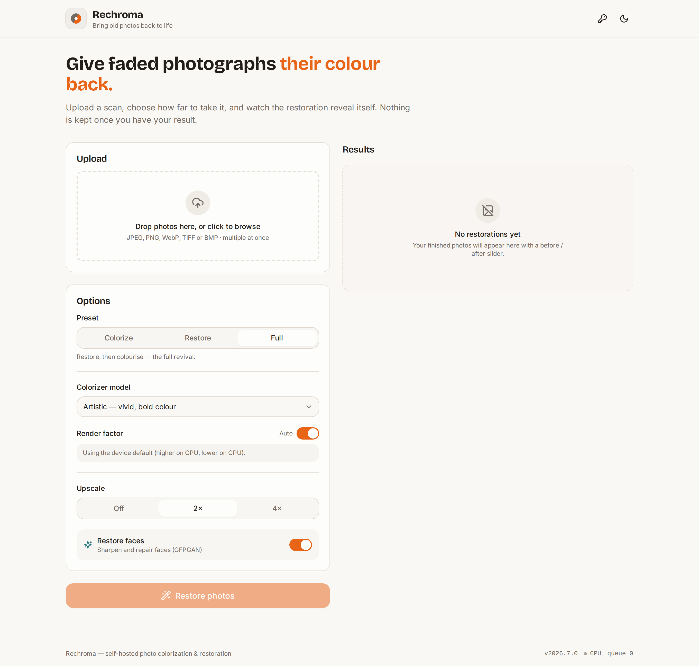
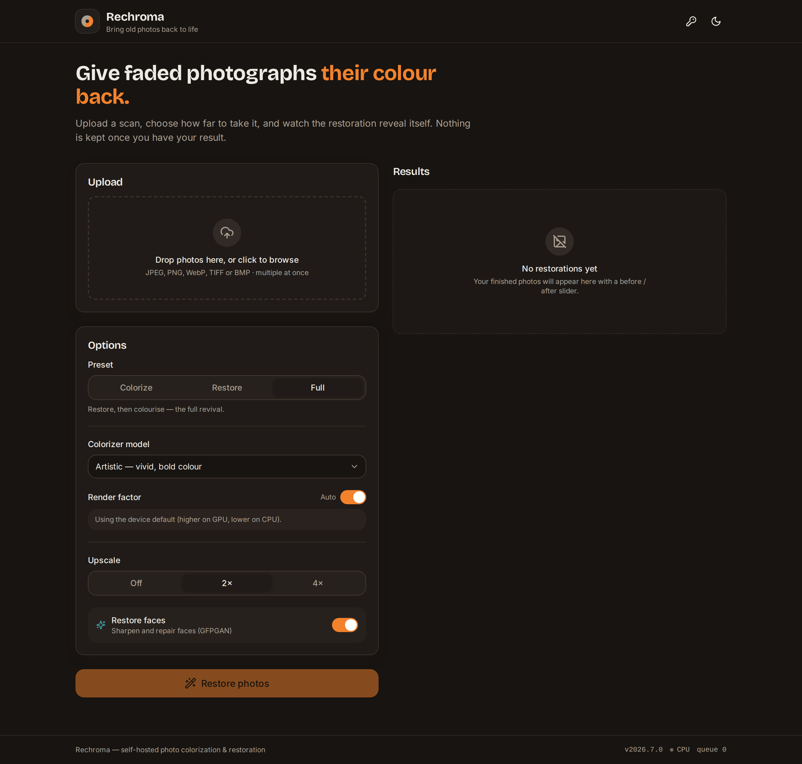
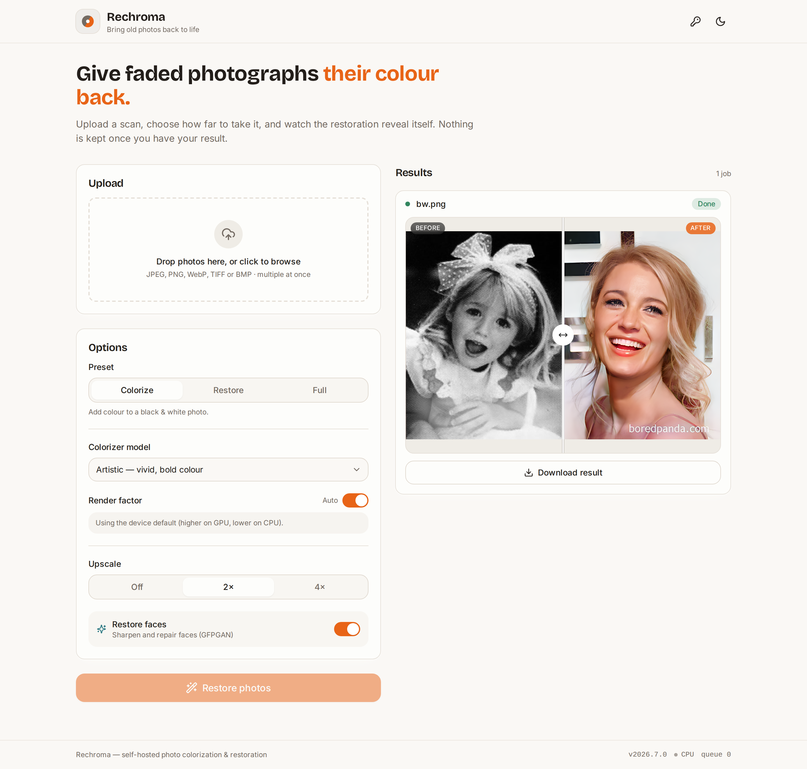
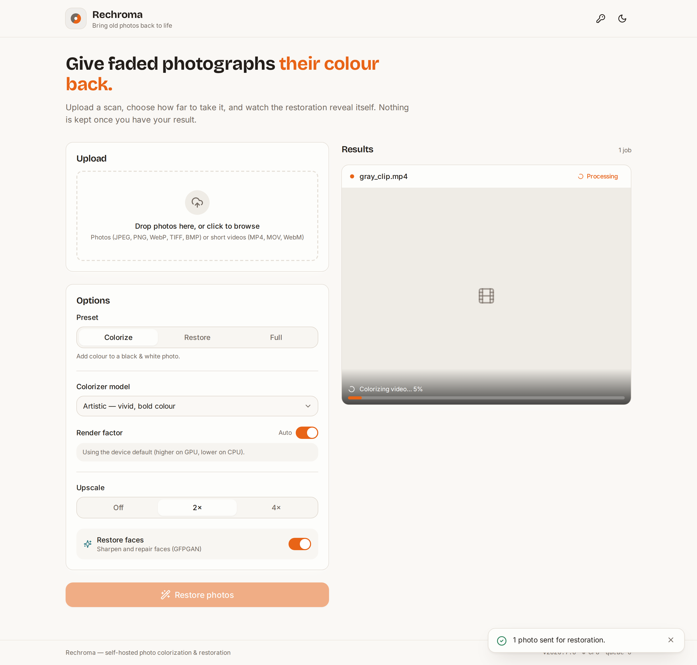
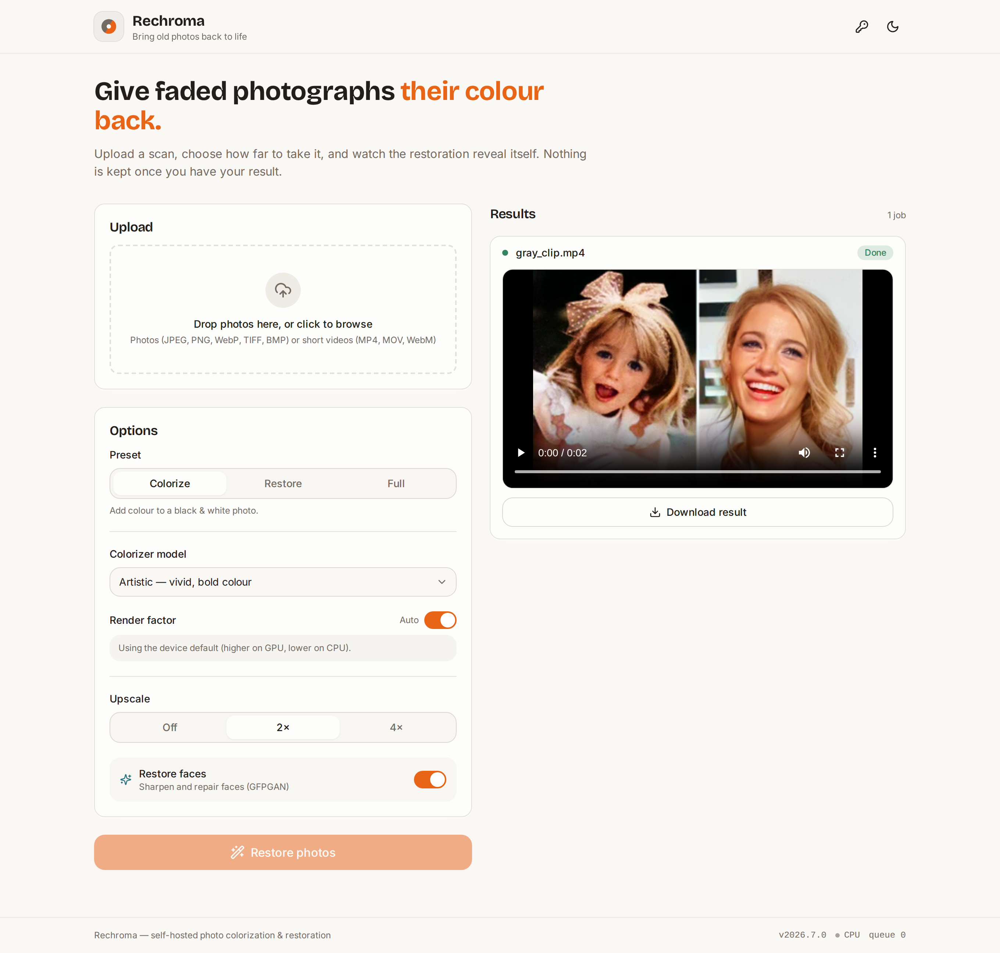
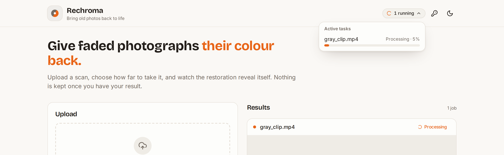
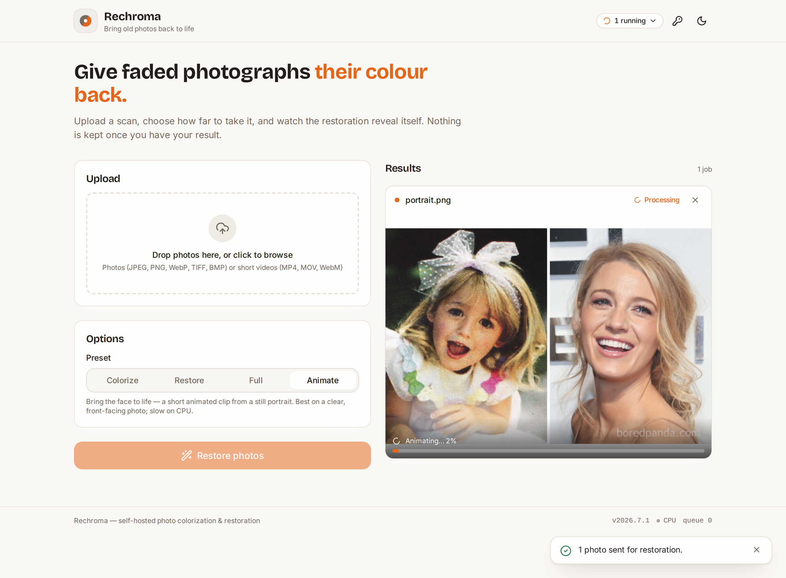
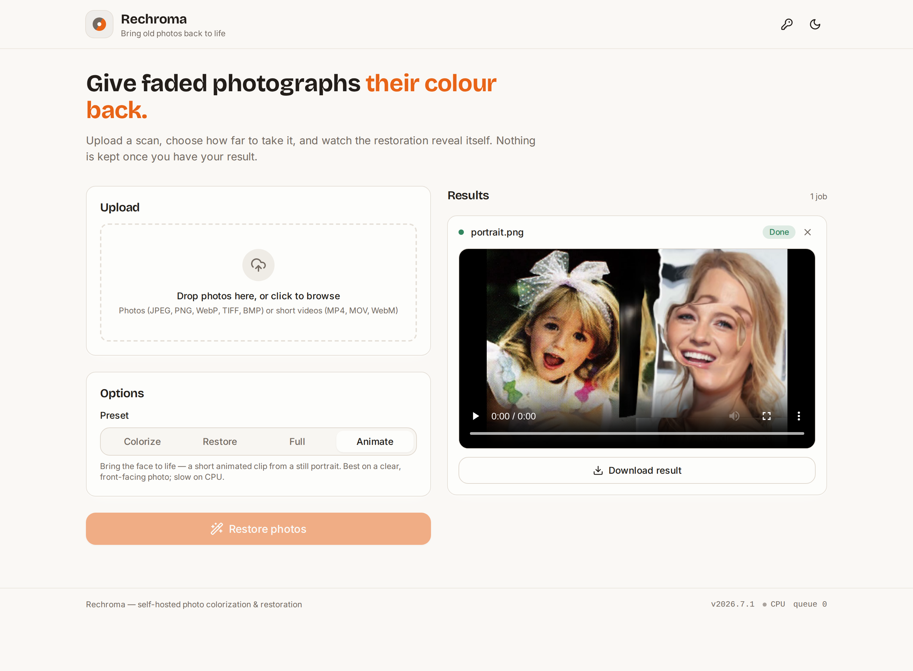

# Rechroma

**Bring old photos back to life** — a self-hosted service that colorizes black &
white photos and restores faded, damaged ones (face restoration, denoising,
upscaling). It runs **with or without a GPU** from a single Docker image, and is
driven through two equal front doors: a **web interface** and a **Telegram bot**,
both thin clients over one shared processing core and job queue.

Rechroma is a ground-up, **fastai-free** re-implementation of DeOldify's
inference stack in modern PyTorch (≥ 2.5), loading the original pretrained
weights — plus GFPGAN face restoration and Real-ESRGAN upscaling.

> Photos in, photos out — nothing is retained by default (originals and results
> are deleted after 24h; configurable, `0` = delete immediately after delivery).

## Demo

A ~40s walkthrough of the web UI — upload a black & white photo, pick a preset,
and get a colorized result with a before/after slider:

https://github.com/user-attachments/assets/34d595f0-1b14-4553-8597-6d11fd28cfc8

_Can't see the player? [Download the demo](assets/demo/rechroma-demo.mp4)._

## Screenshots

### Web UI


### Dark mode


### Before / after
Every result gets a draggable before/after slider (drag the divider to reveal the
restored image) and a full-quality download:



### Video colorization (v2)
Submit a short video and get it back colorized, with its original audio intact and
a live progress bar while it runs:




### Background activity indicator
A header pill shows tasks still running in the background, with per-task status
and live progress:



### Animate (living portrait)
A standalone **Animate** mode brings a still portrait to life — a short animated
clip where the face moves. Pick **Animate** (it's off by default), upload a clear
front-facing photo, and get an mp4 back:




> Powered by the Thin-Plate-Spline Motion Model. **CPU is slow** (seconds per
> frame) — a GPU is strongly recommended. See the licensing note below.

## Features

- **Colorize** B&W / sepia photos — DeOldify *artistic* (vivid) and *stable*
  (portraits/landscapes) backbones.
- **Restore** — GFPGAN face restoration (detect → align → restore → seamless
  paste-back) and Real-ESRGAN 2×/4× upscaling.
- **Presets:** `colorize`, `restore`, `full` (restore → colorize → upscale), each
  step independently toggleable.
- **Runs on CPU or GPU** from one image — device auto-detected, with sensible
  per-device defaults.
- **Two front doors:** web SPA (drag-drop, live job status, before/after slider)
  and a Telegram bot (send a photo → pick a preset → get it back).
- **Activity indicator:** a header pill lists tasks still running in the
  background with their status and live progress, so nothing is happening silently.
- **Removable jobs:** a × on each card (and in the activity popover) cancels a
  queued or running job or dismisses a finished one — a video aborts between frames.
- **Animate (living portrait):** a standalone, opt-in mode that turns a still
  portrait into a short animated clip (TPSMM) — CPU or GPU.
- **In-process async job queue** backed by SQLite (WAL) — no Redis/Postgres/Celery.
- **Privacy first:** no telemetry, configurable retention, EXIF-GPS stripped from
  outputs, upload validation by magic bytes with decompression-bomb protection.
- Weights are **downloaded at first start** with SHA-256 verification into a
  persistent volume (pre-seed or mirror them for air-gapped installs).

## Video (v2)

Video is colorize-only per frame with light **temporal chroma smoothing** to tame
flicker; the original audio is muxed back in. It reuses the same colorization core
as photos — a video is just N frames plus an audio track.

> **A GPU is strongly recommended for video.** On CPU each frame takes seconds, so
> even a short clip can take many minutes. The UI shows a live progress bar.

Conservative, configurable caps protect a self-hosted box (over-cap clips are
rejected, not silently downscaled):

| Cap | Default | Env |
|---|---|---|
| Max duration | 30 s | `RECHROMA_VIDEO_MAX_SECONDS` |
| Max resolution (longer side) | 1080 | `RECHROMA_VIDEO_MAX_RESOLUTION` |
| Processing fps | 24 | `RECHROMA_VIDEO_MAX_FPS` |
| Max upload (web) | 200 MB | `RECHROMA_VIDEO_MAX_MB` |
| Max upload (Telegram) | 20 MB | `RECHROMA_TELEGRAM_VIDEO_MAX_MB` |
| Temporal smoothing window | 5 (`1` = off) | `RECHROMA_VIDEO_SMOOTHING_WINDOW` |
| Render factor | 21 | `RECHROMA_VIDEO_RENDER_FACTOR` |

Telegram accepts videos too (colorize preset), subject to its smaller size cap and
Telegram's own bot download limits. Disable video entirely with
`RECHROMA_VIDEO_ENABLED=false`.

## Quick start (CPU, Docker Compose)

```bash
git clone https://github.com/t0mer/rechroma.git
cd rechroma
docker compose up -d
# open http://localhost:8000  (interactive API docs at /api/docs)
```

On first use, Rechroma downloads the model weights it needs into the
`rechroma-models` volume (verified against pinned checksums). The `rechroma-jobs`
volume holds the SQLite state and transient images.

> **Security:** with no `web_auth_token` set the UI/API is **open** — put it
> behind a reverse proxy or set `RECHROMA_WEB_AUTH_TOKEN`.

## GPU variant

Requires the NVIDIA Container Toolkit on the host.

```bash
docker compose -f docker-compose.gpu.yaml up -d
```

This uses the `:latest-cuda` image (CUDA runtime + GPU PyTorch). Everything else
is identical; the pipeline auto-selects the GPU.

## Telegram bot

Set a bot token (from [@BotFather](https://t.me/BotFather)) and an allowlist, then
the bot starts alongside the web server in the same container:

```yaml
environment:
  TELEGRAM_BOT_TOKEN: "123456:your-token"
  RECHROMA_ADMIN_CHAT_IDS: "11111111"      # always allowed
  RECHROMA_ALLOWED_CHAT_IDS: "222,333"     # additional allowed chats
```

The bot is **never open**: with an empty allowlist only admins may use it. Send a
photo (or a file for full quality), tap **Colorize / Restore / Full**, and get the
result back as an uncompressed document plus a preview. `/settings` sets per-chat
defaults; `/status` shows your queue position. If `TELEGRAM_BOT_TOKEN` is unset the
bot stays disabled and the web UI still runs.

## Command line

The processing core is runnable on its own:

```bash
python -m app.core.cli colorize in.jpg out.jpg --model artistic --render-factor 35
python -m app.core.cli process in.jpg out.jpg --preset full --upscale 2
```

## REST API

Interactive docs (OpenAPI/Swagger) are served at **`/api/docs`**. All actions the
UI performs map to these endpoints:

| Method | Path | Purpose |
|---|---|---|
| `POST` | `/api/v1/jobs` | Submit an image (multipart) + options → job |
| `GET` | `/api/v1/jobs/{id}` | Job status + queue position |
| `GET` | `/api/v1/jobs/{id}/result` | Download the result image |
| `DELETE` | `/api/v1/jobs/{id}` | Cancel/remove a job (queue, running, or finished) |
| `GET` | `/api/v1/jobs` | List recent jobs |
| `GET` | `/healthz` | Health (status, version, device, queue depth) |
| `GET` | `/metrics` | Prometheus metrics |

Auth (when `web_auth_token` is set): `Authorization: Bearer <token>` or
`X-API-Token: <token>`.

## Configuration

Precedence: **CLI flags > env vars > `config.yaml` > defaults.** Every key has an
env var of the form `RECHROMA_<KEY>` (plus `TELEGRAM_BOT_TOKEN`). See
[`config.example.yaml`](config.example.yaml).

| Setting / env | Default | Description |
|---|---|---|
| `RECHROMA_DEVICE` | `auto` | `auto` \| `cuda` \| `cpu` |
| `RECHROMA_MODELS_DIR` | `/data/models` | Weight download/cache dir |
| `RECHROMA_MODEL_BASE_URL` | – | Self-hosted mirror base (`${url}/<filename>`) |
| `RECHROMA_RENDER_FACTOR` | device default | Colorization detail, 7–45 |
| `RECHROMA_PORT` | `8000` | HTTP port |
| `RECHROMA_DATA_DIR` | `/data/jobs` | SQLite DB + images |
| `RECHROMA_WEB_AUTH_TOKEN` | – | Shared bearer token (blank = open) |
| `RECHROMA_MAX_UPLOAD_MB` | `25` | Max upload size |
| `RECHROMA_WORKERS` | `1` | Concurrent pipeline workers |
| `RECHROMA_RETENTION_HOURS` | `24` | Delete finished jobs + files after N hours (`0` = immediately) |
| `RECHROMA_RATE_LIMIT_PER_HOUR` | `10` | Per client/chat; `0` disables |
| `TELEGRAM_BOT_TOKEN` | – | Enables the bot |
| `RECHROMA_ALLOWED_CHAT_IDS` | `[]` | Bot allowlist (empty = admins only) |
| `RECHROMA_ADMIN_CHAT_IDS` | `[]` | Always-allowed chats |
| `RECHROMA_ANIMATE_ENABLED` | `true` | Enable the Animate feature |
| `RECHROMA_ANIMATE_MAX_FRAMES` | `120` | Cap on animated output frames |

## Model credits & licenses

All weights are frozen upstream and downloaded at runtime with pinned SHA-256
checksums (see `app/core/model_registry.py`, the single source of truth). Use
`mirror_models.sh` to mirror them for self-hosting / air-gapped installs.

| Model | Role | License |
|---|---|---|
| `ColorizeArtistic_gen.pth` | DeOldify artistic colorizer | MIT |
| `ColorizeStable_gen.pth` | DeOldify stable colorizer | MIT |
| `GFPGANv1.4.pth` | Face restoration | Apache-2.0 |
| `detection_Resnet50_Final.pth` | Face detection (facexlib RetinaFace) | MIT |
| `parsing_parsenet.pth` | Face parsing (facexlib ParseNet) | MIT |
| `RealESRGAN_x4plus.pth` / `x2plus.pth` | 4× / 2× upscale | BSD-3-Clause |
| `realesr-general-x4v3.pth` | Lightweight upscale (CPU default) | BSD-3-Clause |
| `vox.pth.tar` (TPSMM) | Face animation (living portrait) | **CC BY-SA 4.0** |

Architectures are vendored (inference-only) under `app/core/archs/` with upstream
attribution — [DeOldify](https://github.com/jantic/DeOldify) (MIT),
[GFPGAN](https://github.com/TencentARC/GFPGAN) (Apache-2.0),
[Real-ESRGAN](https://github.com/xinntao/Real-ESRGAN) (BSD-3),
[facexlib](https://github.com/xinntao/facexlib) (MIT),
[TPSMM](https://github.com/yoyo-nb/Thin-Plate-Spline-Motion-Model) (MIT). DDColor
backends are registered for a future release but not yet wired.

> **Animation licensing:** the TPSMM *code* is MIT, but its pretrained `vox`
> weights (and the bundled driving clip in `assets/drivers/`) are VoxCeleb-based
> and licensed **CC BY-SA 4.0** — commercial use is permitted with attribution
> and share-alike. This is the one weight in Rechroma outside the MIT/Apache/BSD
> set; the Animate feature is opt-in.

## Development

```bash
uv sync --dev
uv run pytest            # tests never download model weights
uv run ruff check . && uv run ruff format --check . && uv run mypy app
# frontend
npm --prefix frontend ci && npm --prefix frontend run build
```

CI runs lint, type-check, and tests on every push; the Docker workflow builds and
publishes the CPU (`amd64`) and CUDA (`amd64`) images.

## License

See [LICENSE](LICENSE). Model weights retain their upstream licenses (above).
