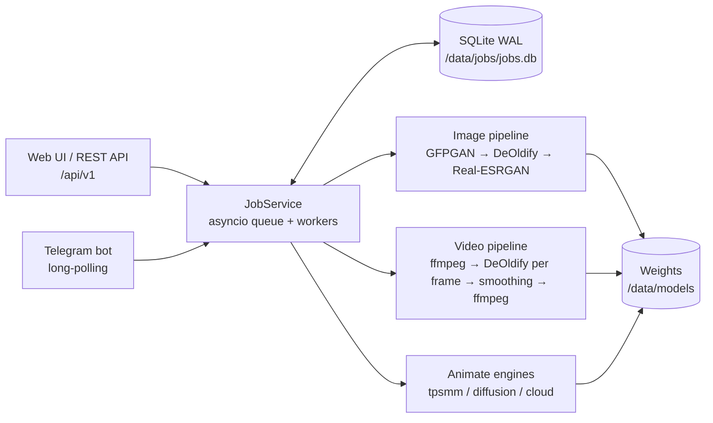

# Rechroma

**Bring old photos back to life.** Rechroma is a self-hosted service that
colorizes black & white photos and restores faded, damaged ones (face
restoration and upscaling). It runs **with or without a GPU** (CPU and CUDA
Docker images built from one codebase) and has two front doors: a **web
interface** and a **Telegram bot**. Both are thin clients over one shared
processing core and job queue.

Rechroma is a ground-up, **fastai-free** re-implementation of DeOldify's
inference stack in modern PyTorch (≥ 2.5) that loads the original pretrained
weights. It adds GFPGAN face restoration, Real-ESRGAN upscaling, per-frame video
colorization, and an optional "living portrait" Animate mode.

> Photos in, photos out. Nothing is kept for long by default: finished jobs and
> their files are deleted by an hourly retention sweep once they are older than
> 24h. The window is configurable, and `0` removes finished jobs at the next sweep.
> Jobs interrupted by a restart are the exception: they stay until you delete them
> (see [Known issues](#known-issues)).

## Contents

- [Demo](#demo)
- [Screenshots](#screenshots)
- [Features](#features)
- [How it works](#how-it-works)
- [Requirements](#requirements)
- [Quick start (CPU, Docker Compose)](#quick-start-cpu-docker-compose)
- [GPU variant](#gpu-variant)
- [Docker images](#docker-images)
- [Video (v2)](#video-v2)
- [Animate (living portrait)](#animate-living-portrait)
- [Telegram bot](#telegram-bot)
- [Command line](#command-line)
- [REST API](#rest-api)
- [Jobs, queue and retention](#jobs-queue-and-retention)
- [Configuration](#configuration)
- [Model weights and self-hosted mirrors](#model-weights-and-self-hosted-mirrors)
- [Security notes](#security-notes)
- [Known issues](#known-issues)
- [Troubleshooting](#troubleshooting)
- [Development](#development)
- [Model credits & licenses](#model-credits--licenses)
- [Contributing](#contributing)
- [License](#license)

## Demo

A ~40s walkthrough of the web UI. Upload a black & white photo, pick a preset,
and get a colorized result with a before/after slider:

https://github.com/user-attachments/assets/34d595f0-1b14-4553-8597-6d11fd28cfc8

_Can't see the player? [Download the demo](assets/demo/rechroma-demo.mp4)._

## Screenshots

### Web UI


### Dark mode


### Before / after
Every result gets a draggable before/after slider (drag the divider to reveal the
restored image) and a full-quality download:


### Video colorization (v2)
Submit a short video and get it back colorized, with its original audio intact and
a live progress bar while it runs:


### Background activity indicator
A header pill shows tasks still running in the background, with per-task status
and live progress:


### Animate (living portrait)


## Features

- **Colorize** B&W / sepia photos with the DeOldify *artistic* (vivid) and
  *stable* (portraits/landscapes) backbones.
- **Restore** with GFPGAN face restoration (detect → align → restore → seamless
  paste-back) and Real-ESRGAN 2×/4× upscaling.
- **Presets:** `colorize`, `restore`, `full` (restore → colorize), with optional
  2×/4× upscaling as a last step. Face restoration can be switched off per job.
- **Runs on CPU or NVIDIA GPU.** The device is auto-detected, with per-device
  defaults (render factor, upscale model).
- **Video colorization** (v2): per-frame colorization with temporal chroma
  smoothing; the original audio is muxed back in.
- **Animate (living portrait):** a standalone, opt-in mode that turns a still
  portrait into a short mp4, with three selectable engines (local TPSMM, local
  diffusion on GPU, or cloud via Replicate).
- **Two front doors:** a web SPA (drag and drop, live job status, before/after
  slider, light/dark theme) and a Telegram bot (send a photo, pick a preset, get
  it back).
- **Activity indicator:** a header pill lists tasks still running in the
  background with their status and live progress.
- **Removable jobs:** a × on each card (and in the activity popover) cancels a
  queued or running job or dismisses a finished one. A running video aborts
  between frames.
- **In-process async job queue** backed by SQLite (WAL). No Redis, Postgres or
  Celery.
- **Privacy first:** no telemetry, configurable retention, EXIF (including GPS)
  dropped from web uploads, upload validation by magic bytes with
  decompression-bomb protection.
- **Health and metrics:** `/healthz` and a Prometheus `/metrics` endpoint.
- Weights are **downloaded on first use** with SHA-256 verification into a
  persistent volume. You can pre-seed them or point Rechroma at your own mirror
  for air-gapped installs.

## How it works


```mermaid
flowchart LR
    Web[Web UI / REST API<br/>/api/v1] --> Svc
    TG[Telegram bot<br/>long-polling] --> Svc
    Svc[JobService<br/>asyncio queue + workers] <--> DB[(SQLite WAL<br/>/data/jobs/jobs.db)]
    Svc --> Img[Image pipeline<br/>GFPGAN → DeOldify → Real-ESRGAN]
    Svc --> Vid[Video pipeline<br/>ffmpeg → DeOldify per frame → smoothing → ffmpeg]
    Svc --> Anim[Animate engines<br/>tpsmm / diffusion / cloud]
    Img & Vid & Anim --> W[(Weights<br/>/data/models)]
```

- One FastAPI process (`uvicorn app.main:create_app --factory`) serves the API,
  the built React frontend, `/healthz` and `/metrics`, and starts the Telegram
  bot when a token is set.
- Jobs are written to SQLite and processed by `RECHROMA_WORKERS` async workers.
  The heavy PyTorch work runs in a thread so the event loop stays responsive.
- The image pipeline order is: face restoration (on the grayscale input) →
  colorization → upscaling. Each step is optional per preset and options.

## Requirements

- **Docker** (recommended). The CPU image works on any `linux/amd64` host.
- For the GPU image: an NVIDIA GPU, a recent driver, and the
  [NVIDIA Container Toolkit](https://docs.nvidia.com/datacenter/cloud-native/container-toolkit/).
- Disk space for weights: about 2 GB for photo features, plus about 350 MB for
  the TPSMM Animate weights. The diffusion engine downloads a multi-GB model on
  top of that.
- Outbound HTTPS to GitHub, Hugging Face and `data.deepai.org` on first use,
  unless you pre-seed weights or run a mirror.
- Running from source: Python 3.12+, `ffmpeg`/`ffprobe` on the `PATH` (video and
  Animate), and Node 20 to build the frontend.
- Optional: a Telegram bot token, a Replicate API token (cloud Animate engine).

Apple Silicon (MPS) is not supported as an accelerator; the device setting
accepts only `auto`, `cuda` or `cpu`.

## Quick start (CPU, Docker Compose)

```bash
git clone https://github.com/t0mer/Rechroma.git
cd Rechroma
docker compose up -d
# open http://localhost:8000  (interactive API docs at /api/docs)
```

On first use, Rechroma downloads the model weights it needs into the
`rechroma-models` volume and checks them against pinned checksums. The
`rechroma-jobs` volume holds the SQLite state and transient images.

The compose file also has a `build:` section, so `docker compose up -d --build`
builds the image from your checkout instead of pulling it (see
[Docker images](#docker-images) for what the published tags contain).

> **Security:** with no `RECHROMA_WEB_AUTH_TOKEN` set the UI/API is **open**. Put
> it behind a reverse proxy or set `RECHROMA_WEB_AUTH_TOKEN`.

Plain `docker run` equivalent:

```bash
docker run -d --name rechroma -p 8000:8000 \
  -v rechroma-models:/data/models \
  -v rechroma-jobs:/data/jobs \
  -e RECHROMA_WEB_AUTH_TOKEN=change-me \
  techblog/rechroma:latest
```

## GPU variant

Requires the NVIDIA Container Toolkit on the host.

```bash
docker compose -f docker-compose.gpu.yaml up -d
```

This uses the `:latest-cuda` image (CUDA 12.6 runtime on Ubuntu 24.04 + GPU
PyTorch) and reserves one NVIDIA GPU. Everything else is identical; with
`RECHROMA_DEVICE=auto` the pipeline picks the GPU. Setting `RECHROMA_DEVICE=cuda`
makes Rechroma fail instead of silently falling back to CPU when no GPU is
visible.

## Docker images

Images are published to Docker Hub as
[`techblog/rechroma`](https://hub.docker.com/r/techblog/rechroma), `linux/amd64`
only:

| Tag | Variant |
|---|---|
| `latest`, `<version>` (e.g. `2026.7.0`) | CPU (`python:3.12-slim` + CPU PyTorch) |
| `latest-cuda`, `<version>-cuda` | CUDA (`nvidia/cuda:12.6.3-runtime-ubuntu24.04` + CUDA PyTorch) |

Versions use the date-based `YYYY.M.PATCH` scheme and match git tags. Both images
run as a non-root user (uid 10001), expose port `8000`, declare the volumes
`/data/models` and `/data/jobs`, and include a `curl`-based `HEALTHCHECK` on
`/healthz`.

> **Note:** the latest published tag, `2026.7.0`, was built before the Animate
> feature was added. To use Animate in Docker, build the image from source
> (`docker compose up -d --build`) until a newer tag is published. Even then, the
> `tpsmm` engine does not work in the containers, because the Dockerfiles copy
> `app/` but not `assets/drivers/`. Only the `diffusion` and `cloud` engines can be
> used in Docker (see [Known issues](#known-issues)).

## Video (v2)

Video is colorize-only: each frame is colorized, light **temporal chroma
smoothing** tames flicker, and the original audio is muxed back in. It reuses the
same colorization core as photos; a video is just N frames plus an audio track.
Accepted containers (detected by magic bytes): mp4, mov, m4v, webm, mkv, avi.

> **A GPU is strongly recommended for video.** On CPU each frame takes seconds, so
> even a short clip can take many minutes. The UI shows a live progress bar.

Conservative, configurable caps protect a self-hosted box. Clips over the
duration or resolution cap are rejected, not silently downscaled:

| Cap | Default | Env |
|---|---|---|
| Max duration | 30 s | `RECHROMA_VIDEO_MAX_SECONDS` |
| Max resolution (longer side) | 1080 | `RECHROMA_VIDEO_MAX_RESOLUTION` |
| Processing fps (frames extracted at ≤ this) | 24 | `RECHROMA_VIDEO_MAX_FPS` |
| Max upload (web) | 200 MB | `RECHROMA_VIDEO_MAX_MB` |
| Max upload (Telegram) | 20 MB | `RECHROMA_TELEGRAM_VIDEO_MAX_MB` |
| Temporal smoothing window | 5 (`1` = off) | `RECHROMA_VIDEO_SMOOTHING_WINDOW` |
| Render factor | 21 | `RECHROMA_VIDEO_RENDER_FACTOR` |
| x264 quality (lower = better) | 18 | `RECHROMA_VIDEO_CRF` |

Telegram accepts videos too (Colorize only), subject to its smaller size cap and
Telegram's own bot download limits. Disable video entirely with
`RECHROMA_VIDEO_ENABLED=false`.

## Animate (living portrait)

A standalone **Animate** mode brings a still portrait to life as a short animated
clip. Pick the **Animate** preset (the default preset is `full`, so Animate only
runs when you choose it), choose an **engine**, upload a clear front-facing
photo, and get an mp4 back. Animate is available in the web UI and REST API, not
in the Telegram bot.

**Three selectable engines** (per job). The UI lists all three and greys out the
ones your install can't run, showing the reason (from
`GET /api/v1/animate/engines`):

| Engine | What it does | Runs on | License / cost |
|---|---|---|---|
| `tpsmm` (default) | Reenacts a single detected face (motion transfer from a bundled driving clip) | CPU or GPU | CC BY-SA 4.0 weights |
| `diffusion` | Whole-scene generative motion (Wan2.1-I2V via Hugging Face `diffusers`) | **CUDA GPU only** | Apache-2.0 |
| `cloud` | Hosted image-to-video via [Replicate](https://replicate.com) | Anywhere (calls out) | pay-per-use; **sends the photo to a third party** |

> **Reality check:** `tpsmm` is lightweight but only animates one face. It is *not*
> full-scene generative video. For "the whole photo comes alive" you need the
> `diffusion` engine (a CUDA GPU, a multi-GB model, minutes per clip) or the
> `cloud` engine. **CPU is slow** for `tpsmm` and cannot run `diffusion` at all.

**`tpsmm`** needs no extra setup when you run from source. It downloads
`vox.pth.tar` plus the RetinaFace face detector on first use and uses the driving
clip `assets/drivers/subtle.mp4` (`RECHROMA_ANIMATE_DRIVER=subtle`). Output is
capped at `RECHROMA_ANIMATE_MAX_FRAMES` frames.

> **Caveat:** `tpsmm` does not work in the Docker images, including images you
> build from source. The Dockerfiles copy only `app/`, not `assets/drivers/`, so the
> engine reports "Driver clip 'subtle' not found". In containers, only `diffusion`
> and `cloud` can be used.

**`diffusion`** is off by default. It needs a CUDA GPU and the `diffusers`
library, which is **not** a dependency of Rechroma and is not installed in the
Docker images. Install it yourself into the environment that runs Rechroma. The
model is downloaded from Hugging Face by `diffusers` on first use.

The default model, `Wan-AI/Wan2.1-I2V-1.3B-Diffusers`, does not exist on Hugging
Face (Wan2.1 image-to-video is only published as 14B variants), so you **must
override it**, for example with `Wan-AI/Wan2.1-I2V-14B-480P-Diffusers`. A 14B
model needs a large-memory GPU.

<!-- TODO: verify: which packages besides diffusers (e.g. transformers, accelerate) Wan2.1-I2V needs; pyproject.toml has no `diffusion` extra that pins them. -->

```yaml
environment:
  RECHROMA_ANIMATE_DIFFUSION_ENABLED: "true"
  RECHROMA_ANIMATE_DIFFUSION_MODEL: Wan-AI/Wan2.1-I2V-14B-480P-Diffusers   # the default does not exist
```

**`cloud`** is off by default. It posts the photo (as a base64 PNG data URI) to
the Replicate API, polls the prediction, and downloads the resulting mp4.
Get an API token from your Replicate account; it is read from the environment
only and never returned by the API. The default model slug,
`wan-video/wan-2.1-i2v-480p`, returns 404 on Replicate, so you **must override
it**, for example with `wavespeedai/wan-2.1-i2v-480p`:

```yaml
environment:
  RECHROMA_ANIMATE_CLOUD_ENABLED: "true"
  REPLICATE_API_TOKEN: "r8_..."          # required for the cloud engine
  RECHROMA_ANIMATE_CLOUD_MODEL: wavespeedai/wan-2.1-i2v-480p   # the default returns 404
```

## Telegram bot

Create a bot with [@BotFather](https://t.me/BotFather), then set its token and an
allowlist. The bot starts alongside the web server in the same container, using
long-polling (no public URL needed):

```yaml
environment:
  RECHROMA_TELEGRAM_BOT_TOKEN: "123456:your-token"
  RECHROMA_ADMIN_CHAT_IDS: "[11111111]"    # always allowed (JSON array)
  RECHROMA_ALLOWED_CHAT_IDS: "[222,333]"   # additional allowed chats (JSON array)
```

> Chat ID lists **must be JSON arrays** (`"[11111111]"`, `"[222,333]"`). A single
> number or a comma- or space-separated list crashes startup; see
> [Known issues](#known-issues).

> The token variable is `RECHROMA_TELEGRAM_BOT_TOKEN`. A bare `TELEGRAM_BOT_TOKEN`
> (as in the commented example in `docker-compose.yaml`) is not read.

The bot is **never open**: with an empty allowlist only admins may use it. An
unknown chat gets a reply with its chat ID so you can add it. If
`RECHROMA_TELEGRAM_BOT_TOKEN` is unset the bot stays disabled and the web UI
still runs.

Usage:

1. Send a photo, or send it as a **file** for full quality. Videos (and GIF
   animations) are accepted too.
2. Tap **Colorize**, **Restore** or **Full** (videos offer **Colorize** only).
3. A status message updates with the queue position and progress. You get the
   result back as a preview photo plus an uncompressed PNG document (or an mp4
   for videos).

`Restore` and `Full` on photos also restore faces and upscale 2×.

| Command | What it does |
|---|---|
| `/start` | Welcome message |
| `/help` | How to use the bot |
| `/settings` | Show your per-chat defaults |
| `/setmodel artistic\|stable` | Default colorizer model |
| `/setrf 7-45\|auto` | Default render factor (`auto` = device default) |
| `/setpreset full\|colorize\|restore` | Stores a default preset, but it is not used: the preset is always the button you tap |
| `/status` | Your queued/running jobs and queue position |

Per-chat defaults are stored in `/data/jobs/chat_settings.db`. The rate limit
(`RECHROMA_RATE_LIMIT_PER_HOUR`) applies per chat.

## Command line

The processing core is runnable on its own, without the web server or job queue
(photos only):

```bash
# Colorize only
python -m app.core.cli colorize in.jpg out.jpg --model artistic --render-factor 35

# Full pipeline preset
python -m app.core.cli process in.jpg out.jpg --preset full --upscale 2
```

| Command | Options |
|---|---|
| `colorize IN OUT` | `--model artistic\|stable` (default `artistic`), `--render-factor N`, `--device auto\|cuda\|cpu` |
| `process IN OUT` | `--preset colorize\|restore\|full` (default `full`), `--model artistic\|stable`, `--render-factor N`, `--upscale 2\|4`, `--no-restore`, `--device auto\|cuda\|cpu` |

The CLI reads the same `RECHROMA_*` environment variables (for example
`RECHROMA_MODELS_DIR`, which defaults to `/data/models`); flags override them.
Inside the container:

```bash
docker compose exec rechroma python -m app.core.cli colorize /data/jobs/in.jpg /data/jobs/out.png
```

## REST API

Interactive docs (OpenAPI/Swagger) are served at **`/api/docs`**. Every action
the UI performs maps to these endpoints:

| Method | Path | Purpose |
|---|---|---|
| `POST` | `/api/v1/jobs` | Submit an image or video (multipart) + options → job (`201`) |
| `GET` | `/api/v1/jobs` | List recent jobs (`?limit=50&offset=0`, limit capped at 200) |
| `GET` | `/api/v1/jobs/{id}` | Job status, progress + queue position |
| `GET` | `/api/v1/jobs/{id}/result` | Download the result: PNG for photos, MP4 for video/Animate (`409` until done) |
| `DELETE` | `/api/v1/jobs/{id}` | Cancel/remove a job (queued, running, or finished) → `204` |
| `GET` | `/api/v1/animate/engines` | Animate engines and whether each is usable on this install |
| `GET` | `/healthz` | Health (status, version, device, queue depth) |
| `GET` | `/metrics` | Prometheus metrics |

`POST /api/v1/jobs` form fields:

| Field | Values | Default |
|---|---|---|
| `file` | image (jpeg, png, webp, tiff, bmp, gif) or video (mp4, mov, webm, mkv, avi) | required |
| `preset` | `colorize` \| `restore` \| `full` \| `animate` | `full` |
| `model` | `artistic` \| `stable` | `artistic` |
| `render_factor` | 7–45 | device default (GPU 35, CPU 25) |
| `upscale` | `2` \| `4` | none |
| `restore_faces` | `true` \| `false` | `true` |
| `engine` | `tpsmm` \| `diffusion` \| `cloud` (Animate only) | `RECHROMA_ANIMATE_ENGINE` |

The file type is detected from its content, not its name. A video upload always
runs the colorize-only video pipeline. Errors: `400` (bad/unsupported file, video
over caps, feature disabled, engine unavailable), `401` (missing or invalid token
when auth is enabled), `413` (too large), `422` (invalid options), `429` (rate
limit).

```bash
TOKEN=change-me
# Submit
curl -s -H "Authorization: Bearer $TOKEN" \
  -F file=@old-photo.jpg -F preset=full -F upscale=2 \
  http://localhost:8000/api/v1/jobs
# → {"id":"<id>","status":"queued","kind":"image","preset":"full","progress":0.0,"queue_position":1,...}

# Poll, then download
curl -s -H "X-API-Token: $TOKEN" http://localhost:8000/api/v1/jobs/<id>
curl -s -H "X-API-Token: $TOKEN" -o result.png http://localhost:8000/api/v1/jobs/<id>/result
```

**Auth:** when `RECHROMA_WEB_AUTH_TOKEN` is set, every `/api/v1` request must send
`Authorization: Bearer <token>` or `X-API-Token: <token>`. `/healthz`, `/metrics`,
`/api/docs` and the static UI are not token-protected.

**Metrics** (`/metrics`, Prometheus text format):

| Metric | Type | Description |
|---|---|---|
| `rechroma_up` | gauge | `1` while the service is running |
| `rechroma_queue_depth` | gauge | Queued jobs |
| `rechroma_jobs_total{status}` | gauge | Jobs currently stored, by status (`queued`, `running`, `done`, `failed`) |

## Jobs, queue and retention

- **Submit:** the upload is validated and stored under `/data/jobs/inputs/`, a
  job row is written to `/data/jobs/jobs.db`, and the job is queued. Results go
  to `/data/jobs/results/`; video and Animate use temporary per-job workspaces
  under `/data/jobs/video/` and `/data/jobs/animate/` that are always cleaned up.
- **Statuses:** `queued` → `running` → `done` or `failed`.
- **Workers:** `RECHROMA_WORKERS` jobs run at once (default 1; models are
  memory-heavy).
- **Rate limit:** `RECHROMA_RATE_LIMIT_PER_HOUR` jobs per source per rolling hour.
  The source is the client IP for the web/API and the chat ID for Telegram.
- **Cancel:** `DELETE /api/v1/jobs/{id}` removes a queued or finished job (record
  and files) at once. A running video or Animate job aborts at its next frame, step or
  poll; a running photo job finishes and its result is then discarded.
- **Restart:** queued jobs are re-queued; jobs that were running are marked
  `failed` ("interrupted by restart"). These jobs never get a finish time, so the
  retention sweep never deletes them: they and their files stay until you delete
  them by hand (`DELETE /api/v1/jobs/{id}` or the × in the UI).
- **Retention:** a sweep runs at startup and then every hour and deletes finished
  (done/failed) jobs, with their input and result files, once they are older than
  `RECHROMA_RETENTION_HOURS`.

## Configuration

Rechroma is configured with **environment variables**. Every setting has an env
var of the form `RECHROMA_<KEY>`; the Replicate token also accepts the plain
`REPLICATE_API_TOKEN`. List values (chat IDs) must be JSON arrays, e.g.
`RECHROMA_ALLOWED_CHAT_IDS="[222,333]"`.

`config.yaml` is **not read**: the settings loader can layer a YAML file, but
neither the server nor the CLI passes it a path. Treat
[`config.example.yaml`](config.example.yaml) as reference only for key names and
defaults. Its header also names the Telegram token variable wrongly
(`TELEGRAM_BOT_TOKEN`; the real one is `RECHROMA_TELEGRAM_BOT_TOKEN`).

| Env var | Default | Description |
|---|---|---|
| **Core / device** | | |
| `RECHROMA_DEVICE` | `auto` | `auto` \| `cuda` \| `cpu`. `cuda` errors if no GPU is available |
| `RECHROMA_MODELS_DIR` | `/data/models` | Weight download/cache dir |
| `RECHROMA_MODEL_BASE_URL` | – | Self-hosted mirror base; files are fetched as `${url}/<filename>` |
| `RECHROMA_RENDER_FACTOR` | device default | Colorization detail, 7–45 (GPU 35, CPU 25). Used only by the CLI `colorize` subcommand (not `process`); web and Telegram jobs use the per-job value or the device default |
| `RECHROMA_LOG_LEVEL` | `info` | Defined but not currently applied |
| **Web / API** | | |
| `RECHROMA_PORT` | `8000` | Defined in settings; the Docker `CMD` always listens on `8000`, so remap with `-p` instead |
| `RECHROMA_DATA_DIR` | `/data/jobs` | SQLite DBs + uploaded/result files |
| `RECHROMA_WEB_AUTH_TOKEN` | – | Shared token for `/api/v1` (blank = open, warned at startup) |
| `RECHROMA_MAX_UPLOAD_MB` | `25` | Max image upload size (also Animate) |
| `RECHROMA_WORKERS` | `1` | Concurrent pipeline workers |
| `RECHROMA_RETENTION_HOURS` | `24` | Delete finished jobs + files older than N hours (hourly sweep; `0` = at the next sweep) |
| `RECHROMA_RATE_LIMIT_PER_HOUR` | `10` | Jobs per client IP / chat per hour; `0` disables |
| **Telegram** | | |
| `RECHROMA_TELEGRAM_BOT_TOKEN` | – | Enables the bot |
| `RECHROMA_TELEGRAM_WEBHOOK_URL` | – | Defined but not used; the bot always long-polls |
| `RECHROMA_ALLOWED_CHAT_IDS` | `[]` | Bot allowlist, JSON array (empty = admins only) |
| `RECHROMA_ADMIN_CHAT_IDS` | `[]` | Always-allowed chats (JSON array) |
| **Video** | | |
| `RECHROMA_VIDEO_ENABLED` | `true` | Enable video colorization |
| `RECHROMA_VIDEO_MAX_SECONDS` | `30` | Reject longer clips |
| `RECHROMA_VIDEO_MAX_RESOLUTION` | `1080` | Reject clips whose longer side exceeds this |
| `RECHROMA_VIDEO_MAX_FPS` | `24` | Frames are extracted at ≤ this fps |
| `RECHROMA_VIDEO_MAX_MB` | `200` | Max video upload (web) |
| `RECHROMA_TELEGRAM_VIDEO_MAX_MB` | `20` | Max video size via Telegram |
| `RECHROMA_VIDEO_SMOOTHING_WINDOW` | `5` | Temporal chroma window; `1` disables |
| `RECHROMA_VIDEO_RENDER_FACTOR` | `21` | Render factor for video frames |
| `RECHROMA_VIDEO_CRF` | `18` | x264 quality (lower = better/larger) |
| `RECHROMA_VIDEO_WORKSPACE_DIR` | `${data_dir}/video` | Temporary frame workspace |
| **Animate** | | |
| `RECHROMA_ANIMATE_ENABLED` | `true` | Enable the Animate feature |
| `RECHROMA_ANIMATE_ENGINE` | `tpsmm` | Default engine: `tpsmm` \| `diffusion` \| `cloud` |
| `RECHROMA_ANIMATE_DRIVER` | `subtle` | (tpsmm) driving clip name in `assets/drivers/` |
| `RECHROMA_ANIMATE_MAX_FRAMES` | `120` | (tpsmm) cap on output frames |
| `RECHROMA_ANIMATE_MAX_RESOLUTION` | `2048` | Defined but not currently enforced |
| `RECHROMA_ANIMATE_CRF` | `18` | (tpsmm) output x264 quality |
| `RECHROMA_ANIMATE_WORKSPACE_DIR` | `${data_dir}/animate` | Temporary workspace |
| `RECHROMA_ANIMATE_DIFFUSION_ENABLED` | `false` | Enable the local diffusion engine (CUDA only) |
| `RECHROMA_ANIMATE_DIFFUSION_MODEL` | `Wan-AI/Wan2.1-I2V-1.3B-Diffusers` | `diffusers` image-to-video repo id. The default does not exist; override it (e.g. `Wan-AI/Wan2.1-I2V-14B-480P-Diffusers`) |
| `RECHROMA_ANIMATE_DIFFUSION_PROMPT` | – | Optional guidance prompt |
| `RECHROMA_ANIMATE_DIFFUSION_FRAMES` | `49` | Frames to generate |
| `RECHROMA_ANIMATE_DIFFUSION_STEPS` | `30` | Inference steps |
| `RECHROMA_ANIMATE_DIFFUSION_FPS` | `16` | Output fps |
| `RECHROMA_ANIMATE_CLOUD_ENABLED` | `false` | Enable the cloud (Replicate) engine |
| `RECHROMA_ANIMATE_CLOUD_MODEL` | `wan-video/wan-2.1-i2v-480p` | Replicate `owner/name` model slug. The default returns 404; override it (e.g. `wavespeedai/wan-2.1-i2v-480p`) |
| `RECHROMA_ANIMATE_CLOUD_PROMPT` | – | Optional guidance prompt |
| `REPLICATE_API_TOKEN` (or `RECHROMA_REPLICATE_API_TOKEN`) | – | Replicate token (required for the cloud engine) |

## Model weights and self-hosted mirrors

Weights are never baked into the image. Each one is downloaded the first time a
feature needs it, written to a `.part` file, checked against the SHA-256 pinned
in [`app/core/model_registry.py`](app/core/model_registry.py) (the single source
of truth), and then moved into `RECHROMA_MODELS_DIR`. A file that is already
present with the right checksum is reused, so you can pre-seed the volume.

| File | Source |
|---|---|
| `ColorizeArtistic_gen.pth` | `data.deepai.org/deoldify` |
| `ColorizeStable_gen.pth` | Hugging Face (`spensercai/DeOldify`) |
| `GFPGANv1.4.pth` | GitHub releases, TencentARC/GFPGAN |
| `detection_Resnet50_Final.pth`, `parsing_parsenet.pth` | GitHub releases, xinntao/facexlib |
| `RealESRGAN_x4plus.pth`, `RealESRGAN_x2plus.pth`, `realesr-general-x4v3.pth` | GitHub releases, xinntao/Real-ESRGAN |
| `vox.pth.tar` | Hugging Face Space `AlekseyKorshuk/thin-plate-spline-motion-model` |

On CPU, upscaling uses the lightweight `realesr-general-x4v3` model; on GPU it
uses `RealESRGAN_x2plus` or `RealESRGAN_x4plus`.

For air-gapped installs, run [`mirror_models.sh`](mirror_models.sh)
(`./mirror_models.sh [target_dir]`, default `./rechroma-models`). It downloads
the weights and writes a `SHA256SUMS` manifest. Upload the folder to any static
host (GitHub release, MinIO, nginx) and set `RECHROMA_MODEL_BASE_URL` to its
base URL.

> **The script currently aborts:** three of its URLs return 404 (the GFPGAN
> `v1.3.0` `detection_Resnet50_Final.pth` and `parsing_parsenet.pth`, and the
> Real-ESRGAN `v0.3.0` `realesr-general-x4v3.pth`). Download those three by hand
> from the URLs in `app/core/model_registry.py`. Its closing message says to set
> `MODEL_BASE_URL`; the real variable is `RECHROMA_MODEL_BASE_URL`. The script
> also does not download `vox.pth.tar` (Animate/tpsmm), so add it by hand if you
> use Animate, and it fetches the DDColor weights, which are registered for a
> future release but not used yet.

## Security notes

- **Authentication:** the API is open unless `RECHROMA_WEB_AUTH_TOKEN` is set
  (a warning is logged at startup). The token is compared in constant time. It
  protects `/api/v1` only; `/healthz`, `/metrics` and `/api/docs` stay public.
  The UI has no login page. When a token is set, click the key icon in the
  header ("API token") and paste the `RECHROMA_WEB_AUTH_TOKEN` value; the UI stores
  it in the browser's `localStorage` and sends it as `X-API-Token`. Put Rechroma
  behind a reverse proxy with TLS (and ideally SSO or basic auth) if it is
  reachable from outside your LAN.
- **Rate limiting** is keyed on the client IP. Behind a reverse proxy every
  request may appear to come from the proxy's IP, so all users share one quota.
- **Uploads:** web uploads are size-checked, type-checked by magic bytes (not the
  file name), decoded under a decompression-bomb guard (a 40 MP warning / 80 MP hard limit), and
  re-saved as PNG without EXIF metadata (orientation is applied first). Videos are
  probed with `ffprobe` and rejected when over the caps. Stored files use
  server-generated names; API responses never expose file paths.
- **Telegram:** access is allowlist-only and never open by default. Keep the bot
  token in an environment variable or secret, not in a committed file.
- **Third-party data sharing:** the only feature that sends your photo off the
  box is the opt-in `cloud` Animate engine, which uploads it to Replicate. Model
  weights are downloaded from GitHub, Hugging Face and deepai.org; nothing else
  is sent out and there is no telemetry.
- **Cloud API key:** `REPLICATE_API_TOKEN` is read from the environment only and
  is never returned by the API. Replicate is pay-per-use, so anyone who can
  submit Animate jobs to an open instance can spend your credits. Enable the cloud
  engine only on an authenticated instance.
- **Data at rest:** inputs, results and SQLite state live in the `/data/jobs`
  volume until the retention sweep removes them (jobs interrupted by a restart
  stay until you delete them by hand). They are not encrypted.

## Known issues

- **Chat ID lists must be JSON arrays.** `RECHROMA_ALLOWED_CHAT_IDS` and
  `RECHROMA_ADMIN_CHAT_IDS` are JSON-decoded by pydantic-settings before the
  comma-splitting validator runs, so `"11111111"` or `"222,333"` crashes startup.
  Use `"[11111111]"` and `"[222,333]"`.
- **`tpsmm` does not work in Docker images** (published or built from source): the
  Dockerfiles don't copy `assets/drivers/`. Use `diffusion` or `cloud` in
  containers, or run from source.
- **Default Animate model ids are invalid.** Override
  `RECHROMA_ANIMATE_DIFFUSION_MODEL` (e.g. `Wan-AI/Wan2.1-I2V-14B-480P-Diffusers`)
  and `RECHROMA_ANIMATE_CLOUD_MODEL` (e.g. `wavespeedai/wan-2.1-i2v-480p`).
- **`config.yaml` is not read.** Configure with environment variables.
- **Jobs interrupted by a restart are never swept** by retention; delete them by
  hand.
- **`mirror_models.sh` aborts** on three 404 URLs (see
  [Model weights](#model-weights-and-self-hosted-mirrors)).

## Troubleshooting

- **The UI/API is open / "web_auth_token is not set" warning:** set
  `RECHROMA_WEB_AUTH_TOKEN` (the log message mentions `WEB_AUTH_TOKEN`; the
  variable needs the `RECHROMA_` prefix).
- **The Telegram bot does not start:** set `RECHROMA_TELEGRAM_BOT_TOKEN` (not
  `TELEGRAM_BOT_TOKEN`) and add your chat ID to `RECHROMA_ADMIN_CHAT_IDS` or
  `RECHROMA_ALLOWED_CHAT_IDS`. The bot replies with your chat ID when you are not
  allowed.
- **`checksum mismatch for <file>`:** the download was corrupted or your mirror
  serves a different file. Delete the file from the models volume and retry, or
  re-mirror.
- **`CUDA requested but no GPU is available`:** you set `RECHROMA_DEVICE=cuda`
  but the container cannot see a GPU. Check the NVIDIA Container Toolkit and use
  `docker-compose.gpu.yaml`, or set `RECHROMA_DEVICE=auto`.
- **A video is rejected:** it is longer than `RECHROMA_VIDEO_MAX_SECONDS`, larger
  than `RECHROMA_VIDEO_MAX_RESOLUTION` on its longer side, or bigger than
  `RECHROMA_VIDEO_MAX_MB`.
- **An Animate engine is greyed out:** `GET /api/v1/animate/engines` returns the
  reason (disabled, missing `REPLICATE_API_TOKEN`, `diffusers` not installed, no
  CUDA GPU, driver clip not found).
- **Jobs show `failed` with "interrupted by restart":** the container stopped
  while they were running. Submit them again, and delete the failed ones by hand
  (retention never removes them).
- **Telegram says "Something went wrong" on a long job:** the bot stops waiting
  after 15 minutes, but the job keeps running on the server. Use the web UI or API
  to get the result, or send shorter videos.
- **Startup crashes after setting chat IDs:** write them as JSON arrays
  (`"[222,333]"`).

## Development

```bash
uv sync --dev
uv run pytest            # tests never download model weights
uv run ruff check . && uv run ruff format --check . && uv run mypy app
# frontend (Vite outDir -> app/webui/dist, served by FastAPI)
npm --prefix frontend ci && npm --prefix frontend run build
```

Run locally with hot reload (the Vite dev server proxies `/api` and `/healthz`
to port 8000):

```bash
RECHROMA_DATA_DIR=./data/jobs RECHROMA_MODELS_DIR=./data/models \
  uv run uvicorn app.main:create_app --factory --reload --port 8000
npm --prefix frontend run dev
```

`uv sync` installs CPU-only PyTorch wheels (see `[tool.uv.sources]` in
`pyproject.toml`).

Project layout:

```
app/
  main.py          FastAPI app factory: API, UI, /healthz, /metrics, lifespan
  config.py        Settings (RECHROMA_* env vars)
  api/             routes, schemas, token auth, upload validation
  core/            pipeline, colorizer, restore, upscale, video, animate, CLI
    archs/         vendored inference-only architectures (DeOldify, GFPGAN, RRDBNet, SRVGG, TPSMM, ...)
    engines/       Animate engines: tpsmm, diffusion, cloud
  jobs/            SQLite job store, async job service, processors
  telegram/        aiogram 3 bot, allowlist, per-chat settings
frontend/          React + TypeScript + Vite + Tailwind SPA
docker/            Dockerfile.cpu, Dockerfile.cuda
assets/            demo, screenshots, Animate driving clips
tests/             pytest suite (api, core, jobs, telegram)
```

CI runs ruff (lint and format), mypy and pytest, and builds the frontend on every
push to `main` and every pull request. The Docker workflow is started manually:
it builds the CPU image, scans it with Trivy (it fails on fixable HIGH/CRITICAL
issues), pushes the CPU and CUDA images, and then pushes a git tag with the
version.

## Model credits & licenses

All weights are frozen upstream and downloaded at runtime with pinned SHA-256
checksums (see [Model weights](#model-weights-and-self-hosted-mirrors)).

| Model | Role | License |
|---|---|---|
| `ColorizeArtistic_gen.pth` | DeOldify artistic colorizer | MIT |
| `ColorizeStable_gen.pth` | DeOldify stable colorizer | MIT |
| `GFPGANv1.4.pth` | Face restoration | Apache-2.0 |
| `detection_Resnet50_Final.pth` | Face detection (facexlib RetinaFace) | MIT |
| `parsing_parsenet.pth` | Face parsing (facexlib ParseNet) | MIT |
| `RealESRGAN_x4plus.pth` / `RealESRGAN_x2plus.pth` | 4× / 2× upscale | BSD-3-Clause |
| `realesr-general-x4v3.pth` | Lightweight upscale (CPU default) | BSD-3-Clause |
| `vox.pth.tar` (TPSMM) | Face animation (`tpsmm` engine) | **CC BY-SA 4.0** |
| Wan2.1-I2V (diffusers) | Generative animation (`diffusion` engine, downloaded by diffusers) | Apache-2.0 |
| Replicate-hosted model (`cloud` engine) | Hosted image-to-video | Replicate terms + the model's own license |

<!-- TODO: verify: the TPSMM vox weights license. model_registry.py says CC BY-SA 4.0, but the weights are downloaded from a third-party Hugging Face Space whose card says apache-2.0, the TPSMM repo is MIT, and VoxCeleb itself is CC BY 4.0. -->

Architectures are vendored (inference-only) under `app/core/archs/` with upstream
attribution: [DeOldify](https://github.com/jantic/DeOldify) (MIT),
[GFPGAN](https://github.com/TencentARC/GFPGAN) (Apache-2.0),
[Real-ESRGAN](https://github.com/xinntao/Real-ESRGAN) (BSD-3-Clause),
[facexlib](https://github.com/xinntao/facexlib) (MIT),
[TPSMM](https://github.com/yoyo-nb/Thin-Plate-Spline-Motion-Model) (MIT). DDColor
(Apache-2.0) is registered for a future release but not yet wired.

> **Animation licensing:** the TPSMM *code* is MIT, but its pretrained `vox`
> weights (and the bundled driving clip in `assets/drivers/`) are VoxCeleb-based
> and licensed **CC BY-SA 4.0**: commercial use is permitted with attribution
> and share-alike. This is the one weight in Rechroma outside the MIT/Apache/BSD
> set; the Animate feature is opt-in.

## Contributing

Issues and pull requests are welcome. Please run the checks from
[Development](#development) (ruff, mypy, pytest, frontend build) before opening a
PR, and keep tests free of model downloads.

## License

Rechroma is licensed under the [Apache License 2.0](LICENSE). Model weights keep
their upstream licenses (see [Model credits & licenses](#model-credits--licenses)).
